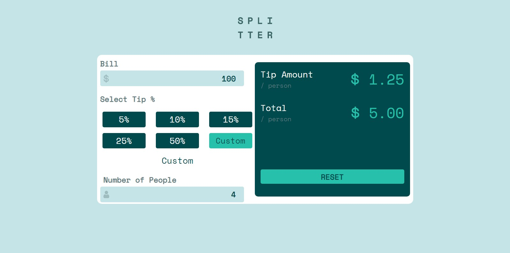

# Frontend Mentor - Tip calculator app solution

This is a solution to the [Tip calculator app challenge on Frontend Mentor](https://www.frontendmentor.io/challenges/tip-calculator-app-ugJNGbJUX). Frontend Mentor challenges help you improve your coding skills by building realistic projects.

## Table of contents

- [Overview](#overview)
  - [The challenge](#the-challenge)
  - [Screenshot](#screenshot)
  - [Links](#links)
- [My process](#my-process)
  - [Built with](#built-with)
  - [What I learned](#what-i-learned)
  - [Continued development](#continued-development)
  - [Useful resources](#useful-resources)
- [Author](#author)

*
## Overview

### The challenge

Users should be able to:

- View the optimal layout for the app depending on their device's screen size
- See hover states for all interactive elements on the page
- Calculate the correct tip and total cost of the bill per person

### Screenshot




### Links

- Solution URL: [Add solution URL here](https://your-solution-url.com)
- Live Site URL: [Add live site URL here](https://your-live-site-url.com)

## My process

### Built with

- Semantic HTML5 markup
- CSS custom properties
- Flexbox
- Vanilla Javascript


### What I learned
I used closure here, save input of bill within that scope
```js
function updateFunc(billValue, numOfPeople) {
    // Here I use closure to save billInput
    return function (percent) {
        var bill = parseFloat(billValue.value);
        tipTotal.textContent = getTipTotal(calcTip(bill, percent)).toFixed(2);

    }
}
```

### Continued development

-- Writing clean code and being able to think of more smart approach to problems
-- More JS !!!

### Useful resources
-- [STACK EXCHANGE EXAMPLE](https://codereview.stackexchange.com/questions/204290/simple-javascript-tip-calculator)

## Author
- Frontend Mentor - [@BlazingMike](https://www.frontendmentor.io/profile/blazing-mike)
- Twitter - [@Mikeoxygen](https://www.twitter.com/Mikeoxygen1)


